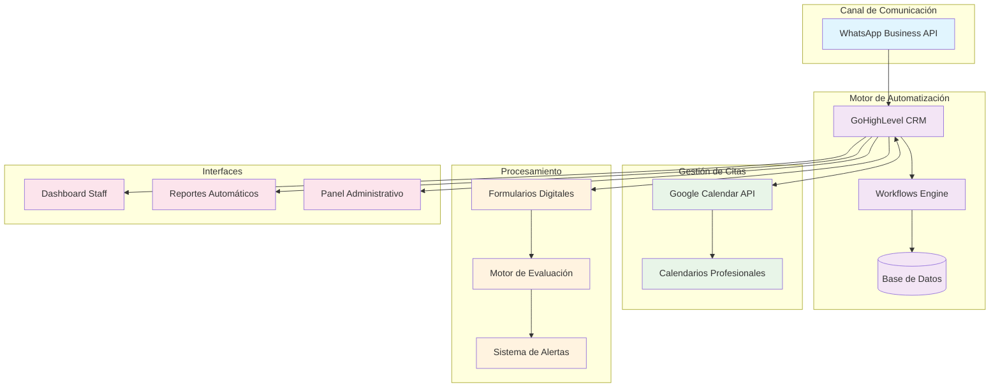
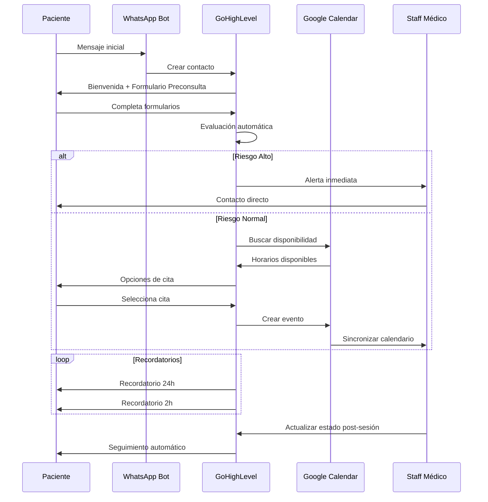

# Visión General de la Arquitectura

## Introducción

El Sistema Integrado UNEME-CECOSAMA está diseñado como una arquitectura de microservicios interconectados que automatiza el flujo complete de atención de pacientes, desde el primer contacto hasta el alta del tratamiento.

## Arquitectura del Sistema

### 🏗️ Diagrama de Arquitectura Principal

## Componentes Principales

### 1. 📱 Capa de Comunicación

=== "WhatsApp Business API"
    **Función**: Canal principal de comunicación bidireccional con pacientes
    
    **Responsabilidades**:
    - Recepción de consultas 24/7
    - Envío de mensajes automáticos y notificaciones
    - Recolección de información mediante formularios conversacionales
    - Escalación automática a personal humano
    
    **Tecnologías**:
    - WhatsApp Business API (Official)
    - Webhooks para integración en tiempo real
    - Template messages para notificaciones masivas

### 2. 🧠 Capa de Automatización

=== "GoHighLevel CRM"
    **Función**: Motor central de automatización y gestión de datos
    
    **Responsabilidades**:
    - Gestión del pipeline de pacientes
    - Almacenamiento seguro de información clínica
    - Ejecución de workflows automatizados
    - Generación de reportes y métricas
    
    **Características técnicas**:
    - API REST completa
    - Webhooks bidireccionales
    - Custom fields para datos clínicos
    - Automation builder visual

=== "Motor de Workflows"
    **Función**: Orquestación de procesos automáticos
    
    **Flujos principales**:
    - Proceso de admisión automatizado
    - Seguimiento de tratamiento
    - Detección y escalación de emergencias
    - Generación de reportes compliance

### 3. 📅 Capa de Gestión de Citas

=== "Google Calendar Integration"
    **Función**: Gestión centralizada y sincronizada de citas
    
    **Responsabilidades**:
    - Verificación de disponibilidad en tiempo real
    - Creación automática de eventos
    - Sincronización con dispositivos móviles del staff
    - Generación de recordatorios
    
    **Integración**:
    - Google Calendar API v3
    - Sincronización bidireccional con GoHighLevel
    - Webhooks para cambios en tiempo real

### 4. 📊 Capa de Procesamiento

=== "Formularios Digitales"
    **Función**: Digitalización y procesamiento de instrumentos clínicos
    
    **Formularios soportados**:
    - Preconsulta (Datos básicos del paciente)
    - PHQ-9 (Evaluación de depresión)
    - AUDIT (Evaluación de consumo de alcohol)
    - Escalas especializadas según necesidad
    
    **Características**:
    - Validación automática de respuestas
    - Cálculo automático de puntajes
    - Interpretación automática de resultados

=== "Motor de Evaluación"
    **Función**: Análisis automático de riesgo y asignación de prioridades
    
    **Algoritmos**:
    - Detección de ideación suicida (PHQ-9 pregunta 9)
    - Evaluación de riesgo por consumo (AUDIT > 8 puntos)
    - Clasificación de urgencia (Inmediata, 24h, 7 días)
    
    **Salidas**:
    - Alertas automáticas al equipo médico
    - Asignación automática a especialista
    - Protocolo de emergencia si es necesario

## Flujo de Datos

### 📈 Ciclo de Vida de un Paciente

## Principios de Diseño

### 🔒 Seguridad y Privacidad

- **Cifrado end-to-end** para todas las comunicaciones
- **Acceso basado en roles** para personal médico
- **Logs de auditoría** para todos los accesos a datos
- **Cumplimiento RGPD** y normativas mexicanas

### 📈 Escalabilidad

- **Arquitectura modular** permite crecimiento independiente
- **APIs stateless** para alta disponibilidad
- **Cache distribuido** para optimización de rendimiento
- **Load balancing** automático

### 🔄 Integración

- **APIs RESTful** estándar para todas las integraciones
- **Webhooks** para notificaciones en tiempo real
- **Formato JSON** para intercambio de datos
- **Versionado de APIs** para compatibilidad

### 🛡️ Confiabilidad

- **Redundancia** en servicios críticos
- **Backup automático** de datos clínicos
- **Monitoreo 24/7** de todos los componentes
- **Recuperación automática** de fallos

## Consideraciones Técnicas

### ⚡ Performance

| Componente | SLA Objetivo | Métricas |
|------------|--------------|----------|
| WhatsApp Response | < 3 segundos | Tiempo de respuesta promedio |
| Calendar Sync | < 5 segundos | Latencia de sincronización |
| Form Processing | < 2 segundos | Tiempo de validación |
| Report Generation | < 30 segundos | Tiempo de generación |

### 🔍 Monitoreo

- **Health checks** automáticos cada 30 segundos
- **Alertas proactivas** por email y SMS
- **Dashboard en tiempo real** para administradores
- **Métricas de uso** y performance

### 📊 Analytics

- **Funnel de conversión** de lead a paciente activo
- **Métricas de satisfacción** automáticas
- **Análisis de abandono** en diferentes etapas
- **ROI** del sistema de automatización

---

## Próximos Pasos Técnicos

1. **Configuración de entornos** (desarrollo, staging, producción)
2. **Implementación de APIs** de integración
3. **Desarrollo de workflows** personalizados
4. **Testing de carga** y performance
5. **Capacitación técnica** del equipo

!!! tip "Optimización Continua"
    El sistema está diseñado para aprendizaje continuo y optimización basada en datos de uso real.

!!! warning "Dependencias Críticas"
    El sistema depende de la disponibilidad de APIs externas (WhatsApp, Google). Se recomienda implementar planes de contingencia.