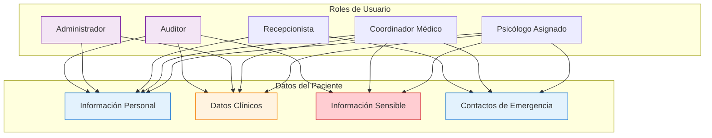

# Privacidad y Protección de Datos

## Introducción

El Sistema UNEME-CECOSAMA maneja información médica altamente sensible que requiere el más alto nivel de protección y cumplimiento con normativas nacionales e internacionales de privacidad de datos médicos.

## Marco Normativo Aplicable

### 🇲🇽 Normativa Mexicana

=== "Ley Federal de Protección de Datos Personales (LFPDPPP)"
    **Aplicabilidad**: Sector público mexicano
    
    **Principios Fundamentales**:
    - **Licitud**: Tratamiento conforme a ley
    - **Finalidad**: Uso específico y determinado
    - **Lealtad**: Tratamiento conforme a expectativas del titular
    - **Consentimiento**: Autorización del titular
    - **Calidad**: Datos exactos, completos y actualizados
    - **Proporcionalidad**: Datos necesarios para la finalidad
    - **Información**: Transparencia en el tratamiento
    - **Responsabilidad**: Garantizar cumplimiento normativo

=== "Ley General de Salud - NOM-024-SSA3-2012"
    **Aplicabilidad**: Sistemas de información en salud
    
    **Requisitos Específicos**:
    - Confidencialidad de información clínica
    - Consentimiento informado documentado
    - Acceso restringido por niveles de autorización
    - Auditoría de accesos a expedientes
    - Backup y recuperación de información médica

=== "Normas de la Secretaría de Salud"
    **NOM-004-SSA3-2012**: Expediente clínico
    **NOM-024-SSA3-2012**: Sistemas de información
    **NOM-025-SSA3-2013**: Organización y funcionamiento

### 🌍 Estándares Internacionales

=== "GDPR - Reglamento General de Protección de Datos"
    **Aplicabilidad**: Si se procesan datos de ciudadanos europeos
    
    **Principios Clave**:
    - Derecho al olvido
    - Portabilidad de datos
    - Notificación de brechas en 72 horas
    - Designación de Data Protection Officer (DPO)
    - Privacy by Design

=== "HIPAA - Health Insurance Portability and Accountability Act"
    **Aplicabilidad**: Estándares de referencia internacional
    
    **Controles Técnicos**:
    - Cifrado de datos en tránsito y reposo
    - Control de acceso basado en roles
    - Logs de auditoría exhaustivos
    - Backup seguro y recuperación

## Clasificación de Datos

### 🔒 Tipos de Datos y Niveles de Protección

| Categoría | Tipo de Datos | Nivel de Protección | Acceso Autorizado |
|-----------|--------------|-------------------|------------------|
| **Datos Identificativos** | Nombre, CURP, teléfono, dirección | Alto | Personal médico asignado |
| **Datos Clínicos** | PHQ-9, AUDIT, diagnósticos, tratamientos | Crítico | Profesional tratante + supervisor |
| **Datos Sensibles** | Ideación suicida, adicciones, violencia | Máximo | Profesional + coordinador médico |
| **Datos de Contacto** | Familiares, emergencia, referencias | Alto | Personal médico + administrativo |
| **Datos del Sistema** | Logs, métricas, uso del sistema | Medio | Administradores técnicos |

### 📊 Matriz de Acceso por Rol



## Controles Técnicos de Seguridad

### 🔐 Cifrado y Protección de Datos

=== "Cifrado en Tránsito"
    **TLS 1.3 Obligatorio**
    ```nginx
    # Configuración Nginx para HTTPS
    server {
        listen 443 ssl http2;
        ssl_protocols TLSv1.3;
        ssl_ciphers ECDHE-RSA-AES256-GCM-SHA512:DHE-RSA-AES256-GCM-SHA512;
        ssl_prefer_server_ciphers off;
        ssl_session_cache shared:SSL:10m;
        
        # HSTS Header
        add_header Strict-Transport-Security "max-age=63072000; includeSubDomains; preload";
        
        # Security Headers
        add_header X-Frame-Options DENY;
        add_header X-Content-Type-Options nosniff;
        add_header Referrer-Policy "strict-origin-when-cross-origin";
    }
    ```

=== "Cifrado en Reposo"
    **AES-256 para Base de Datos**
    ```sql
    -- Configuración MySQL para cifrado
    SET GLOBAL innodb_encryption_rotate_key_age = 1;
    SET GLOBAL innodb_encryption_threads = 4;
    
    -- Crear tabla con cifrado
    CREATE TABLE patient_data (
        id INT PRIMARY KEY,
        sensitive_data JSON,
        created_at TIMESTAMP
    ) ENCRYPTION='Y';
    ```

=== "Gestión de Claves"
    ```yaml
    # Configuración de gestión de claves
    encryption:
      key_management:
        provider: "AWS KMS"  # o equivalente local
        key_rotation: "90_days"
        backup_keys: "encrypted_multiple_locations"
        access_control: "role_based"
    ```

### 🛡️ Control de Acceso

=== "Autenticación Multi-Factor"
    ```javascript
    // Implementación 2FA obligatorio
    const authenticationPolicy = {
        mfa_required: true,
        mfa_methods: ['SMS', 'authenticator_app', 'email'],
        session_timeout: 30, // minutos
        password_policy: {
            min_length: 12,
            require_uppercase: true,
            require_lowercase: true,
            require_numbers: true,
            require_symbols: true,
            password_history: 12,
            max_attempts: 3
        }
    };
    ```

=== "Control de Acceso Basado en Roles (RBAC)"
    ```json
    {
      "roles": {
        "psicologo_clinico": {
          "permissions": [
            "read_patient_basic",
            "read_patient_clinical",
            "write_session_notes",
            "update_treatment_plan"
          ],
          "data_scope": "assigned_patients_only"
        },
        "coordinador_medico": {
          "permissions": [
            "read_all_patients",
            "assign_professionals", 
            "access_crisis_alerts",
            "generate_reports"
          ],
          "data_scope": "all_patients"
        },
        "auditor": {
          "permissions": [
            "read_audit_logs",
            "read_patient_anonymized",
            "generate_compliance_reports"
          ],
          "data_scope": "audit_data_only"
        }
      }
    }
    ```

### 📝 Auditoría y Logs

=== "Logging Obligatorio"
    ```javascript
    // Sistema de auditoría completo
    function logDataAccess(action, userId, patientId, dataType, ipAddress) {
        const auditLog = {
            timestamp: new Date().toISOString(),
            action: action, // 'READ', 'WRITE', 'UPDATE', 'DELETE'
            user_id: userId,
            user_role: getUserRole(userId),
            patient_id: patientId,
            data_type: dataType,
            ip_address: ipAddress,
            session_id: getSessionId(),
            success: true,
            risk_level: calculateRiskLevel(action, dataType)
        };
        
        // Almacenar en sistema de auditoría inmutable
        auditDatabase.insertImmutable(auditLog);
        
        // Alertas para acciones de alto riesgo
        if (auditLog.risk_level === 'HIGH') {
            sendSecurityAlert(auditLog);
        }
    }
    ```

=== "Monitoreo en Tiempo Real"
    ```yaml
    # Configuración de alertas de seguridad
    security_monitoring:
      alerts:
        - name: "Múltiples accesos fallidos"
          condition: "failed_logins > 5 in 10_minutes"
          action: "block_ip_and_notify_admin"
        
        - name: "Acceso fuera de horario"
          condition: "access_time NOT BETWEEN 06:00 AND 22:00"
          action: "require_additional_authentication"
        
        - name: "Descarga masiva de datos"
          condition: "data_export > 100_records in 1_hour"
          action: "block_action_and_notify_security"
        
        - name: "Acceso desde ubicación inusual"
          condition: "ip_geolocation NOT IN approved_regions"
          action: "require_manager_approval"
    ```

## Consentimiento Informado Digital

### 📜 Formulario de Consentimiento

=== "Consentimiento Completo"
    ```html
    <div class="informed-consent">
        <h2>📋 Consentimiento Informado para Tratamiento Digital</h2>
        
        <div class="consent-section">
            <h3>1. Tratamiento de Datos Personales</h3>
            <p>Acepto que UNEME-CECOSAMA procese mis datos personales y de salud para:</p>
            <ul>
                <li>✅ Brindar atención médica y psicológica especializada</li>
                <li>✅ Comunicación relacionada con mi tratamiento</li>
                <li>✅ Seguimiento de mi evolución clínica</li>
                <li>✅ Generación de reportes estadísticos anonimizados</li>
            </ul>
        </div>
        
        <div class="consent-section">
            <h3>2. Medios de Comunicación Digital</h3>
            <label>
                <input type="checkbox" required>
                Autorizo recibir comunicación vía WhatsApp para:
                <ul>
                    <li>Recordatorios de citas</li>
                    <li>Envío de formularios de evaluación</li>
                    <li>Seguimiento de tratamiento</li>
                </ul>
            </label>
        </div>
        
        <div class="consent-section">
            <h3>3. Información Sensible</h3>
            <label>
                <input type="checkbox" required>
                Entiendo que en caso de detectarse riesgo para mi seguridad, 
                el equipo médico podrá contactar a mis familiares o autoridades 
                competentes para garantizar mi bienestar.
            </label>
        </div>
        
        <div class="consent-section">
            <h3>4. Derechos del Titular</h3>
            <p>Conozco mis derechos ARCO (Acceso, Rectificación, Cancelación, Oposición):</p>
            <ul>
                <li>📧 Contacto: privacidad@uneme-cecosama.gob.mx</li>
                <li>📞 Teléfono: [PENDIENTE - VALIDAR]</li>
                <li>🏢 Oficina de Atención a Usuarios</li>
            </ul>
        </div>
        
        <div class="final-consent">
            <label>
                <input type="checkbox" required>
                <strong>He leído, entendido y acepto este consentimiento informado</strong>
            </label>
            
            <div class="signature-section">
                <p>Firma Digital: <span id="digital-signature"></span></p>
                <p>Fecha: <span id="consent-date"></span></p>
                <p>IP Address: <span id="ip-address"></span></p>
            </div>
        </div>
    </div>
    ```

=== "Para Menores de Edad"
    ```html
    <div class="minor-consent">
        <h3>👨‍👩‍👧‍👦 Consentimiento para Menores de Edad</h3>
        
        <div class="parent-info">
            <h4>Datos del Padre/Madre/Tutor:</h4>
            <input type="text" placeholder="Nombre completo" required>
            <input type="text" placeholder="Parentesco" required>
            <input type="tel" placeholder="Teléfono" required>
            <input type="email" placeholder="Email" required>
        </div>
        
        <div class="minor-assent">
            <h4>🧒 Asentimiento del Menor:</h4>
            <label>
                <input type="checkbox" required>
                Entiendo que voy a recibir ayuda médica y que mis papás 
                han dado permiso para que me traten aquí.
            </label>
        </div>
        
        <div class="parent-consent">
            <label>
                <input type="checkbox" required>
                Como padre/madre/tutor legal, autorizo el tratamiento 
                de los datos personales y de salud de mi hijo/a menor de edad.
            </label>
        </div>
    </div>
    ```

## Retención y Eliminación de Datos

### 🗂️ Política de Retención

| Tipo de Dato | Período de Retención | Criterio de Eliminación | Método de Eliminación |
|---------------|-------------------|----------------------|---------------------|
| **Expediente Clínico** | 7 años post-alta | Requerimiento legal | Eliminación segura certificada |
| **Datos de Contacto** | 3 años post-inactividad | Inactividad del paciente | Anonimización |
| **Logs de Auditoría** | 5 años | Cumplimiento normativo | Archivo seguro offline |
| **Datos de WhatsApp** | 1 año | Finalización de tratamiento | Eliminación automática |
| **Reportes Estadísticos** | Indefinido | Datos anonimizados | No aplicable |

### 🔄 Proceso de Eliminación Segura

```javascript
// Proceso automatizado de eliminación
class SecureDataDeletion {
    async deletePatientData(patientId, deletionReason) {
        const deletionLog = {
            patient_id: patientId,
            deletion_date: new Date(),
            reason: deletionReason,
            authorized_by: getCurrentUser(),
            data_types_deleted: []
        };
        
        // 1. Verificar período de retención cumplido
        const retentionCheck = await this.verifyRetentionPeriod(patientId);
        if (!retentionCheck.canDelete) {
            throw new Error(`Retention period not met: ${retentionCheck.reason}`);
        }
        
        // 2. Crear backup para auditoría
        await this.createAuditBackup(patientId);
        
        // 3. Eliminación en cascada
        const deletedData = await this.cascadeDelete(patientId);
        deletionLog.data_types_deleted = deletedData;
        
        // 4. Sobrescritura segura (DoD 5220.22-M)
        await this.secureOverwrite(deletedData.fileLocations);
        
        // 5. Registro inmutable de eliminación
        await this.logDeletion(deletionLog);
        
        return deletionLog;
    }
    
    async secureOverwrite(fileLocations) {
        // Implementar estándar DoD 5220.22-M
        // 3 pasadas de sobrescritura
        for (const location of fileLocations) {
            await this.overwritePass(location, '0x00'); // Paso 1: ceros
            await this.overwritePass(location, '0xFF'); // Paso 2: unos
            await this.overwritePass(location, 'random'); // Paso 3: aleatorio
        }
    }
}
```

## Transferencia Internacional de Datos

### 🌍 Consideraciones para Transferencias

=== "Evaluación de Adecuación"
    ```javascript
    const internationalTransferPolicy = {
        allowed_countries: [
            'Canada', // Decisión de adecuación
            'Switzerland', // Decisión de adecuación
            'Argentina' // Decisión de adecuación
        ],
        
        transfer_mechanisms: {
            adequacy_decision: 'preferred',
            standard_contractual_clauses: 'backup_option',
            binding_corporate_rules: 'not_applicable'
        },
        
        prohibited_countries: [
            // Países sin protección adecuada
            'China', 'Russia', // Por políticas de datos
        ],
        
        data_localization: {
            patient_data: 'mexico_only',
            audit_logs: 'mexico_only',
            statistical_reports: 'transfer_allowed'
        }
    };
    ```

=== "Contratos de Transferencia"
    ```yaml
    # Cláusulas contractuales estándar
    transfer_contract:
      data_controller: "UNEME-CECOSAMA"
      data_processor: "[Proveedor externo]"
      
      obligations:
        - "Procesar datos solo según instrucciones"
        - "Implementar medidas técnicas apropiadas"
        - "Notificar brechas en 24 horas"
        - "Retornar/eliminar datos al término"
        - "Permitir auditorías de cumplimiento"
      
      liability:
        - "Responsabilidad solidaria por daños"
        - "Seguro de responsabilidad civil"
        - "Indemnización por incumplimiento"
    ```

## Gestión de Incidentes de Seguridad

### 🚨 Procedimiento de Respuesta a Incidentes

=== "Clasificación de Incidentes"
    ```javascript
    const incidentClassification = {
        CRITICAL: {
            description: "Exposición de datos médicos sensibles",
            response_time: "1 hora",
            notification_required: ["authorities", "patients", "media"],
            example: "Base de datos médica comprometida"
        },
        
        HIGH: {
            description: "Acceso no autorizado a datos personales",
            response_time: "4 horas", 
            notification_required: ["authorities", "patients"],
            example: "Empleado accede datos fuera de autorización"
        },
        
        MEDIUM: {
            description: "Vulnerabilidad técnica identificada",
            response_time: "24 horas",
            notification_required: ["management"],
            example: "Fallo en sistema de autenticación"
        },
        
        LOW: {
            description: "Incidente menor sin exposición",
            response_time: "72 horas",
            notification_required: ["IT_team"],
            example: "Error en logs de auditoría"
        }
    };
    ```

=== "Plan de Respuesta"
    ```mermaid
    flowchart TD
        A[Detección de Incidente] --> B{Clasificar Severidad}
        B -->|Crítico| C[Activar Equipo de Crisis]
        B -->|Alto| D[Notificar Coordinador]
        B -->|Medio/Bajo| E[Asignar a IT]
        
        C --> F[Contener Amenaza Inmediatamente]
        D --> G[Evaluar Impacto]
        E --> H[Investigar y Documentar]
        
        F --> I[Notificar Autoridades < 24h]
        G --> J[Implementar Controles]
        H --> K[Aplicar Correcciones]
        
        I --> L[Comunicar a Pacientes Afectados]
        J --> M[Monitorear Resolución]
        K --> N[Actualizar Procedimientos]
        
        L --> O[Reporte Final]
        M --> O
        N --> O
    ```

### 📊 Métricas de Cumplimiento

| Métrica | Objetivo | Frecuencia de Medición | Responsable |
|---------|----------|----------------------|-------------|
| **Tiempo de Detección** | < 4 horas | Continuo | SOC Team |
| **Tiempo de Contención** | < 1 hora (crítico) | Por incidente | CISO |
| **Completitud de Logs** | 100% | Diario | Auditor |
| **Capacitación del Personal** | 100% anual | Trimestral | RRHH |
| **Auditorías Externas** | Sin hallazgos críticos | Anual | Dirección |

---

## Checklist de Cumplimiento

### ✅ Implementación Técnica
- [ ] Cifrado TLS 1.3 implementado
- [ ] Base de datos cifrada (AES-256)
- [ ] Autenticación multi-factor obligatoria
- [ ] Logs de auditoría completos
- [ ] Backup cifrado y seguro

### ✅ Procedimientos Operativos
- [ ] Política de privacidad publicada
- [ ] Consentimientos informados digitales
- [ ] Procedimiento de derechos ARCO
- [ ] Plan de respuesta a incidentes
- [ ] Capacitación del personal

### ✅ Cumplimiento Legal
- [ ] Registro en SNPDP (si aplica)
- [ ] Contratos con procesadores
- [ ] Evaluaciones de impacto realizadas
- [ ] Documentación de cumplimiento
- [ ] Auditorías programadas

!!! danger "Responsabilidad Institucional"
    El cumplimiento de privacidad de datos es responsabilidad institucional. Cualquier incumplimiento puede resultar en sanciones legales, pérdida de confianza y daño reputacional.

!!! tip "Mejora Continua"
    Revisar y actualizar políticas de privacidad cada 6 meses o cuando cambien las normativas aplicables.

!!! warning "Validaciones Pendientes"
    **[PENDIENTE - VALIDAR CON CLIENTE]**:
    - Contacto específico para ejercicio de derechos ARCO
    - Procedimientos internos de la institución
    - Autoridad de control específica regional
    - Requisitos adicionales de la Secretaría de Salud local