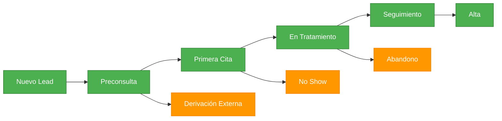
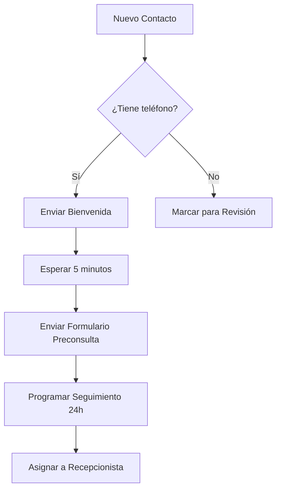
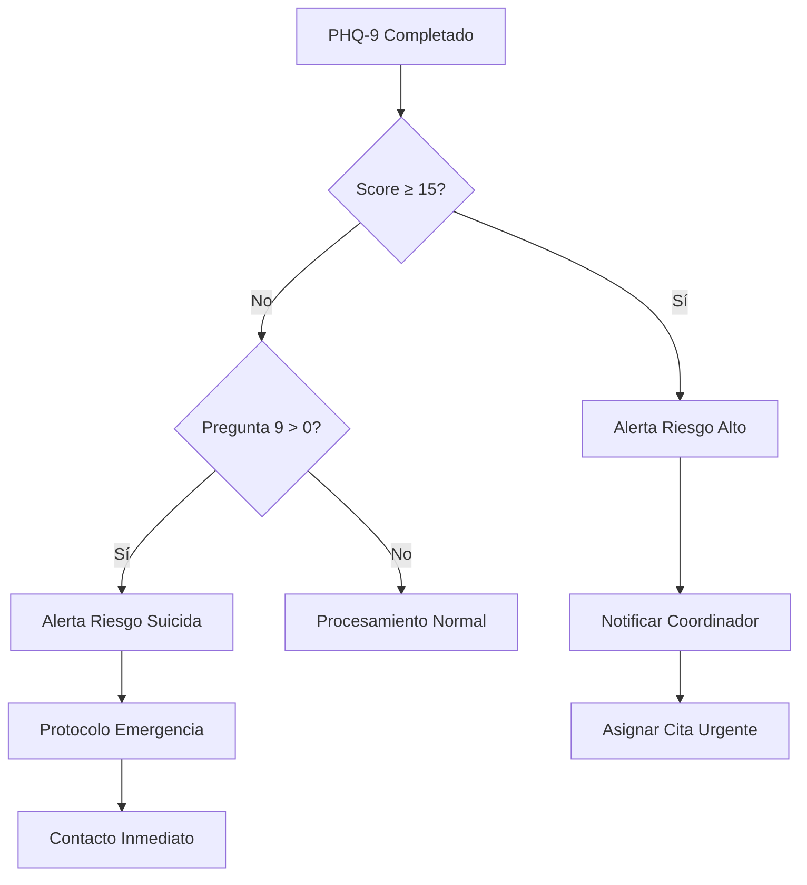
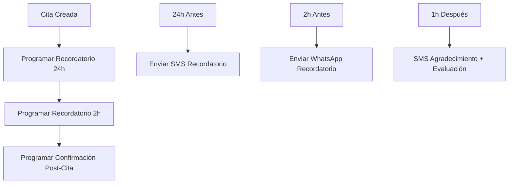

# Configuración de GoHighLevel

## Introducción

GoHighLevel será el CRM central que orquestará todo el sistema UNEME-CECOSAMA. Esta sección detalla la configuración completa necesaria para el funcionamiento optimal del sistema.

## Setup Inicial

### 🔧 Configuración de Cuenta

1. **Tipo de cuenta requerida**: Agency Pro ($497/mes)
2. **Sub-cuenta dedicada**: UNEME-CECOSAMA
3. **Usuarios necesarios**: Mínimo 5 licencias

### 👥 Estructura de Usuarios y Roles

| Rol | Permisos | Responsabilidades |
|-----|----------|-------------------|
| **Administrador** | Acceso completo | Configuración sistema, reportes generales |
| **Coordinador Médico** | Pipeline, reportes, configuración | Supervisión de casos, asignación profesionales |
| **Psicólogo/Psiquiatra** | Contactos asignados, calendar | Gestión de pacientes asignados |
| **Recepcionista** | Calendar, contactos básicos | Confirmación citas, primer contacto |
| **Reportes** | Solo lectura reportes | Compliance, métricas institucionales |

## Configuración del Pipeline

### 📊 Etapas del Pipeline Principal



### 🏥 Configuración Detallada de Etapas

=== "1. Nuevo Lead"
    **Criterios de entrada**:
    - Primer contacto vía WhatsApp
    - Información básica capturada (nombre, teléfono)
    
    **Automatizaciones activas**:
    - Envío de mensaje de bienvenida
    - Asignación automática de etiquetas
    - Creación de tarea de seguimiento
    
    **Campos requeridos**:
    - Nombre completo
    - Teléfono principal
    - Motivo de consulta inicial
    - Fuente de referencia

=== "2. Preconsulta"
    **Criterios de entrada**:
    - Formularios básicos enviados
    - Contacto confirmó interés en tratamiento
    
    **Automatizaciones activas**:
    - Envío de PHQ-9 y AUDIT
    - Evaluación automática de riesgo
    - Asignación de prioridad
    
    **Campos requeridos**:
    - Formulario preconsulta completado
    - PHQ-9 score
    - AUDIT score
    - Evaluación de riesgo

=== "3. Primera Cita"
    **Criterios de entrada**:
    - Formularios completados
    - Cita agendada en calendario
    
    **Automatizaciones activas**:
    - Recordatorios automáticos (24h, 2h)
    - Preparación de expediente
    - Notificación al profesional asignado
    
    **Campos requeridos**:
    - Fecha y hora de cita
    - Profesional asignado
    - Tipo de consulta
    - Status de confirmación

=== "4. En Tratamiento"
    **Criterios de entrada**:
    - Primera cita realizada
    - Plan de tratamiento definido
    
    **Automatizaciones activas**:
    - Programación de citas recurrentes
    - Seguimiento de asistencia
    - Evaluaciones periódicas
    
    **Campos requeridos**:
    - Plan de tratamiento
    - Frecuencia de sesiones
    - Profesional a cargo
    - Próxima evaluación

=== "5. Seguimiento"
    **Criterios de entrada**:
    - Tratamiento completado
    - Alta médica autorizada
    
    **Automatizaciones activas**:
    - Encuestas de satisfacción
    - Seguimiento a 1, 3, 6 meses
    - Evaluación de resultados
    
    **Campos requeridos**:
    - Fecha de alta
    - Resultado de tratamiento
    - Plan de seguimiento
    - Próxima evaluación

## Custom Fields Requeridos

### 👤 Información del Paciente

| Campo | Tipo | Requerido | Descripción |
|-------|------|-----------|-------------|
| `edad_paciente` | Number | Sí | Edad actual del paciente |
| `sexo_biologico` | Dropdown | Sí | Hombre/Mujer/Intersexual |
| `genero_identidad` | Dropdown | No | Masculino/Femenino/No binario/Otro |
| `estado_civil` | Dropdown | Sí | Soltero/Casado/Divorciado/Viudo/Unión libre |
| `escolaridad` | Dropdown | Sí | Primaria/Secundaria/Preparatoria/Licenciatura/Posgrado |
| `ocupacion` | Text | Sí | Ocupación actual del paciente |
| `derechohabiencia` | Dropdown | No | IMSS/ISSSTE/Ninguna/Otra |

### 🏠 Información de Contacto

| Campo | Tipo | Requerido | Descripción |
|-------|------|-----------|-------------|
| `direccion_completa` | Text Area | Sí | Calle, número, colonia, CP, municipio |
| `telefono_emergencia` | Phone | Sí | Contacto de emergencia |
| `parentesco_emergencia` | Text | Sí | Relación con contacto de emergencia |
| `familiar_responsable` | Text | No | Nombre del familiar responsable (menores) |

### 🧠 Información Clínica

| Campo | Tipo | Requerido | Descripción |
|-------|------|-----------|-------------|
| `motivo_consulta` | Text Area | Sí | Motivo principal de la consulta |
| `phq9_score` | Number | No | Puntaje PHQ-9 (0-27) |
| `audit_score` | Number | No | Puntaje AUDIT (0-40) |
| `riesgo_suicida` | Dropdown | No | Bajo/Medio/Alto/Crítico |
| `riesgo_consumo` | Dropdown | No | Sin riesgo/Riesgo/Dependencia |
| `tratamientos_previos` | Text Area | No | Historial de tratamientos anteriores |

### 📅 Información de Tratamiento

| Campo | Tipo | Requerido | Descripción |
|-------|------|-----------|-------------|
| `profesional_asignado` | Dropdown | No | Psicólogo/Psiquiatra asignado |
| `tipo_tratamiento` | Dropdown | No | Individual/Grupal/Familiar |
| `frecuencia_sesiones` | Dropdown | No | Semanal/Quincenal/Mensual |
| `fecha_primera_cita` | Date | No | Fecha de primera consulta |
| `fecha_ultima_cita` | Date | No | Fecha de última sesión |
| `total_sesiones` | Number | No | Número total de sesiones |

## Configuración de Tags

### 🏷️ Sistema de Etiquetas

=== "Fuente de Referencia"
    - `ref-familia` - Referido por familia
    - `ref-medico` - Referido por médico
    - `ref-escuela` - Referido por institución educativa
    - `ref-trabajo` - Referido por trabajo
    - `ref-auto` - Iniciativa propia
    - `ref-justicia` - Referido por sistema de justicia

=== "Tipo de Paciente"
    - `paciente-adulto` - Mayor de 18 años
    - `paciente-adolescente` - 12-18 años
    - `paciente-menor` - Menor de 12 años
    - `paciente-familia` - Terapia familiar

=== "Condición Clínica"
    - `depresion-leve` - PHQ-9: 5-9 puntos
    - `depresion-moderada` - PHQ-9: 10-14 puntos
    - `depresion-severa` - PHQ-9: 15+ puntos
    - `riesgo-alcohol` - AUDIT: 8+ puntos
    - `riesgo-suicida` - Ideación suicida presente
    - `ansiedad` - Síntomas de ansiedad reportados

=== "Status de Tratamiento"
    - `primera-vez` - Primera consulta en UNEME
    - `reingreso` - Ha tenido tratamiento previo
    - `alta-medica` - Tratamiento completado exitosamente
    - `abandono` - Abandonó tratamiento
    - `derivacion-externa` - Referido a otra institución

=== "Urgencia"
    - `urgente-24h` - Requiere atención en 24 horas
    - `urgente-48h` - Requiere atención en 48 horas
    - `programada` - Cita regular programada
    - `emergencia` - Requiere atención inmediata

## Webhooks y Integraciones

### 🔗 Webhooks Requeridos

| Evento | URL Destino | Método | Descripción |
|--------|-------------|--------|-------------|
| Contact Created | `/webhook/new-contact` | POST | Nuevo paciente en sistema |
| Opportunity Stage Changed | `/webhook/stage-change` | POST | Cambio de etapa en pipeline |
| Calendar Event Created | `/webhook/appointment-created` | POST | Nueva cita programada |
| Custom Field Updated | `/webhook/field-update` | POST | Actualización de campos críticos |
| Form Submitted | `/webhook/form-submitted` | POST | Formulario completado |

### 📡 Configuración de API

```json
{
  "webhook_config": {
    "url": "https://api.uneme-system.com/webhook/ghl",
    "headers": {
      "Authorization": "Bearer YOUR_API_TOKEN",
      "Content-Type": "application/json"
    },
    "events": [
      "contact.created",
      "contact.updated", 
      "opportunity.stage_changed",
      "calendar.event_created",
      "calendar.event_updated",
      "form.submitted"
    ]
  }
}
```

## Workflows de Automatización

### 🤖 Workflow 1: Nuevo Paciente

**Trigger**: Nuevo contacto creado vía WhatsApp



**Configuración**:
- **Trigger**: Contact Created
- **Conditions**: Source = "WhatsApp" AND Phone is not empty
- **Actions**:
  1. Send SMS "Bienvenida UNEME-CECOSAMA"
  2. Wait 5 minutes
  3. Send SMS with Preconsulta form link
  4. Create task "Seguimiento preconsulta" (Due: +24 hours)
  5. Assign to user "Recepcionista"

### 🚨 Workflow 2: Detección de Riesgo

**Trigger**: Custom field `phq9_score` updated



**Configuración**:
- **Trigger**: Custom Field Updated
- **Conditions**: Field = "phq9_score"
- **Actions**:
  - If PHQ-9 ≥ 15: Send internal notification "Alto riesgo depresión"
  - If PHQ-9 question 9 > 0: Activate suicide risk protocol
  - Create urgent task for medical coordinator
  - Tag contact with appropriate risk level

### 📅 Workflow 3: Recordatorios de Cita

**Trigger**: Calendar event created



## Reportes y Analytics

### 📊 Dashboard Principal

**Métricas en Tiempo Real**:
- Nuevos leads hoy/semana/mes
- Conversión de lead a primera cita
- Tasa de no-shows
- Pacientes en tratamiento activo
- Casos de riesgo pendientes

**Widgets requeridos**:
1. **Pipeline Overview** - Distribución por etapas
2. **Appointment Summary** - Citas hoy/mañana
3. **Risk Alerts** - Casos que requieren atención inmediata
4. **Performance Metrics** - KPIs principales
5. **Staff Workload** - Distribución de casos por profesional

### 📈 Reportes Automáticos

| Reporte | Frecuencia | Recipients | Contenido |
|---------|------------|------------|-----------|
| **Reporte Diario** | Lunes-Viernes 8 AM | Coordinador médico | Citas del día, casos urgentes |
| **Reporte Semanal** | Lunes 9 AM | Equipo completo | Métricas semanales, casos nuevos |
| **Reporte Mensual** | 1ro de cada mes | Dirección, coordinación | KPIs, compliance, estadísticas |
| **Reporte Trimestral** | Cada 3 meses | Dirección | Análisis de tendencias, ROI |

## Configuración Avanzada

### 🔒 Configuraciones de Seguridad

- **2FA obligatorio** para todos los usuarios
- **Logs de auditoría** activados para acciones críticas
- **Backup automático** cada 24 horas
- **Retención de datos** según normativas mexicanas

### 🌐 Integraciones Adicionales

- **Google Calendar** - Sincronización bidireccional
- **WhatsApp Business API** - Comunicación automatizada
- **Sistema de reportes** - Exportación automática
- **Herramientas de compliance** - Auditoría y cumplimiento

---

## Checklist de Implementación

### ✅ Configuración Inicial
- [ ] Crear sub-cuenta UNEME-CECOSAMA
- [ ] Configurar usuarios y roles
- [ ] Implementar custom fields
- [ ] Configurar pipeline de pacientes
- [ ] Crear sistema de tags

### ✅ Automatizaciones
- [ ] Configurar webhooks
- [ ] Implementar workflows críticos
- [ ] Probar escalación de riesgos
- [ ] Configurar recordatorios automáticos

### ✅ Reportes y Monitoreo
- [ ] Configurar dashboard principal
- [ ] Implementar reportes automáticos
- [ ] Configurar alertas de sistema
- [ ] Validar métricas de compliance

!!! warning "Validación Requerida"
    **[PENDIENTE - VALIDAR CON CLIENTE]**: Confirmar estructura exacta de roles de usuario, horarios de operación y frecuencia de reportes específicos requeridos por la institución.

!!! tip "Optimización Continua"
    Se recomienda revisar y optimizar workflows cada 30 días basado en datos de uso real y feedback del equipo médico.