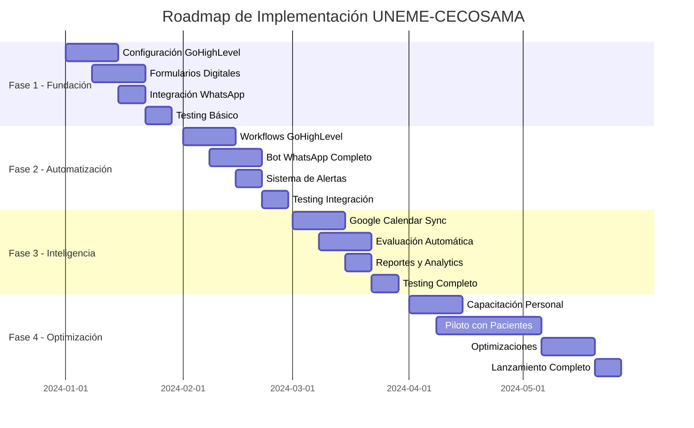

# Fases del Proyecto - Roadmap de Implementación

## Introducción

La implementación del Sistema Integrado UNEME-CECOSAMA se realizará en 4 fases progresivas, cada una construyendo sobre la anterior para minimizar riesgos y maximizar la adopción exitosa por parte del equipo médico.

## Visión General de Fases

### 📊 Cronograma General

## Fase 1: Fundación Digital (4 semanas)

### 🎯 Objetivo Principal
Establecer la infraestructura básica del sistema y los primeros componentes funcionales.

### 📋 Entregables Clave

=== "Semana 1-2: Configuración GoHighLevel"
    **Tareas**:
    - [ ] Crear sub-cuenta UNEME-CECOSAMA
    - [ ] Configurar usuarios y roles de acceso
    - [ ] Implementar custom fields para datos clínicos
    - [ ] Configurar pipeline básico de pacientes
    - [ ] Crear sistema de tags y categorización
    
    **Criterios de Aceptación**:
    - ✅ 5 usuarios del equipo médico con acceso configurado
    - ✅ Pipeline con 6 etapas principales funcionando
    - ✅ 25+ custom fields para datos clínicos implementados
    - ✅ Sistema de tags operativo y documentado

=== "Semana 2-3: Formularios Digitales"
    **Tareas**:
    - [ ] Desarrollar formulario de Preconsulta responsive
    - [ ] Implementar cuestionario PHQ-9 interactivo
    - [ ] Crear formulario AUDIT digital
    - [ ] Configurar validaciones en tiempo real
    - [ ] Integrar envío de datos a GoHighLevel
    
    **Criterios de Aceptación**:
    - ✅ Formularios funcionan perfectamente en móviles
    - ✅ Validaciones previenen errores de captura
    - ✅ Datos se sincronizan automáticamente con GHL
    - ✅ Tiempo de llenado < 5 minutos por formulario

=== "Semana 3-4: Integración WhatsApp"
    **Tareas**:
    - [ ] Configurar WhatsApp Business API
    - [ ] Implementar webhooks bidireccionales
    - [ ] Crear mensajes de bienvenida automáticos
    - [ ] Configurar envío automático de formularios
    - [ ] Testing básico de flujo de comunicación
    
    **Criterios de Aceptación**:
    - ✅ Bot responde en < 30 segundos
    - ✅ Formularios se envían automáticamente
    - ✅ Datos de WhatsApp se sincronizan con GHL
    - ✅ Mensajes automáticos funcionan 24/7

### 📊 Métricas de Éxito Fase 1

| Métrica | Objetivo | Método de Validación |
|---------|----------|---------------------|
| **Setup GoHighLevel** | 100% funcional | Testing de todos los workflows |
| **Formularios Móviles** | > 95% compatibilidad | Testing en 10+ dispositivos |
| **WhatsApp Response** | < 30 segundos | Testing automatizado 24/7 |
| **Sincronización Datos** | 100% precisión | Validación manual de 50 casos |

## Fase 2: Automatización Inteligente (4 semanas)

### 🎯 Objetivo Principal
Implementar la lógica de automatización que permita al sistema tomar decisiones inteligentes basadas en la información de los pacientes.

### 📋 Entregables Clave

=== "Semana 5-6: Workflows GoHighLevel"
    **Tareas**:
    - [ ] Crear workflow de nuevo paciente
    - [ ] Implementar automatización de seguimientos
    - [ ] Configurar triggers para alertas médicas
    - [ ] Desarrollar workflow de asignación automática
    - [ ] Crear automatizaciones de recordatorios
    
    **Criterios de Aceptación**:
    - ✅ 5 workflows principales funcionando automáticamente
    - ✅ Asignación de profesionales 90% automatizada
    - ✅ Seguimientos automáticos sin intervención humana
    - ✅ Alertas médicas se envían en < 5 minutos

=== "Semana 6-7: Bot WhatsApp Completo"
    **Tareas**:
    - [ ] Implementar reconocimiento de intenciones
    - [ ] Crear flujos conversacionales completos
    - [ ] Configurar respuestas contextuales
    - [ ] Implementar escalación automática a humanos
    - [ ] Crear manejo de casos especiales
    
    **Criterios de Aceptación**:
    - ✅ Bot maneja 80% de consultas sin escalación
    - ✅ Reconoce 15+ intenciones diferentes
    - ✅ Escalación funciona en casos críticos
    - ✅ Conversaciones naturales y fluidas

=== "Semana 7-8: Sistema de Alertas"
    **Tareas**:
    - [ ] Implementar detección automática de crisis
    - [ ] Configurar alertas por PHQ-9 alto
    - [ ] Crear protocolo de riesgo suicida
    - [ ] Implementar notificaciones al equipo médico
    - [ ] Configurar logs de auditoría
    
    **Criterios de Aceptación**:
    - ✅ 100% de casos críticos generan alerta
    - ✅ Equipo médico notificado en < 15 minutos
    - ✅ Protocolo de crisis funciona 24/7
    - ✅ Zero falsos negativos en detección de riesgo

### 📊 Métricas de Éxito Fase 2

| Métrica | Objetivo | Método de Validación |
|---------|----------|---------------------|
| **Automatización GHL** | > 90% procesos automáticos | Análisis de workflows por 1 semana |
| **Bot Accuracy** | > 85% respuestas correctas | Testing con 100 conversaciones |
| **Alert Response Time** | < 15 minutos crisis | Simulación de 20 casos críticos |
| **Escalation Success** | > 95% casos apropiados | Revisión manual de escalaciones |

## Fase 3: Inteligencia del Sistema (4 semanas)

### 🎯 Objetivo Principal
Integrar capacidades avanzadas de gestión de citas, análisis predictivo y generación de reportes automáticos.

### 📋 Entregables Clave

=== "Semana 9-10: Google Calendar Sync"
    **Tareas**:
    - [ ] Configurar Google Calendar API
    - [ ] Implementar sincronización bidireccional
    - [ ] Crear gestión automática de disponibilidad
    - [ ] Configurar tipos de citas y duraciones
    - [ ] Implementar manejo de conflictos
    
    **Criterios de Aceptación**:
    - ✅ Sincronización en tiempo real < 30 segundos
    - ✅ Zero conflictos de horarios
    - ✅ Disponibilidad actualizada automáticamente
    - ✅ 5 tipos de citas configuradas correctamente

=== "Semana 10-11: Evaluación Automática"
    **Tareas**:
    - [ ] Implementar algoritmos de evaluación PHQ-9
    - [ ] Crear sistema de scoring AUDIT
    - [ ] Desarrollar matriz de riesgo automática
    - [ ] Configurar asignación inteligente de profesionales
    - [ ] Implementar recomendaciones de tratamiento
    
    **Criterios de Aceptación**:
    - ✅ Evaluación automática 95% precisión vs. manual
    - ✅ Asignación profesional apropiada > 90%
    - ✅ Recomendaciones basadas en evidencia
    - ✅ Tiempo de evaluación < 2 minutos

=== "Semana 11-12: Reportes y Analytics"
    **Tareas**:
    - [ ] Crear dashboard de métricas en tiempo real
    - [ ] Implementar reportes automáticos diarios
    - [ ] Configurar analytics de uso del sistema
    - [ ] Crear reportes de compliance médico
    - [ ] Implementar alertas de performance
    
    **Criterios de Aceptación**:
    - ✅ Dashboard actualizado cada 5 minutos
    - ✅ Reportes automáticos 100% precisos
    - ✅ Analytics históricos disponibles
    - ✅ Compliance reports generados automáticamente

### 📊 Métricas de Éxito Fase 3

| Métrica | Objetivo | Método de Validación |
|---------|----------|---------------------|
| **Calendar Sync** | 100% sincronización | Testing con 50 citas simultáneas |
| **Risk Assessment** | > 95% precisión | Validación con equipo médico |
| **Report Accuracy** | 100% datos correctos | Auditoría de 200 reportes |
| **System Performance** | < 3 seg response time | Monitoring automatizado |

## Fase 4: Optimización y Lanzamiento (5 semanas)

### 🎯 Objetivo Principal
Capacitar al equipo, realizar pruebas con pacientes reales y optimizar el sistema basado en feedback real antes del lanzamiento completo.

### 📋 Entregables Clave

=== "Semana 13-14: Capacitación Personal"
    **Tareas**:
    - [ ] Crear materiales de capacitación
    - [ ] Entrenar a coordinadores médicos
    - [ ] Capacitar a profesionales en el sistema
    - [ ] Entrenar a personal de recepción
    - [ ] Crear procedimientos de operación estándar
    
    **Criterios de Aceptación**:
    - ✅ 100% del personal capacitado
    - ✅ Evaluación de conocimiento > 90%
    - ✅ Procedimientos documentados y aprobados
    - ✅ Personal cómodo usando el sistema

=== "Semana 14-18: Piloto con Pacientes"
    **Tareas**:
    - [ ] Lanzar piloto con 50 pacientes
    - [ ] Monitorear todas las métricas clave
    - [ ] Recolectar feedback de pacientes y staff
    - [ ] Identificar puntos de mejora
    - [ ] Realizar ajustes basados en uso real
    
    **Criterios de Aceptación**:
    - ✅ 50 pacientes completan el flujo exitosamente
    - ✅ Satisfacción de pacientes > 8.5/10
    - ✅ Satisfacción del staff > 8.0/10
    - ✅ Zero incidentes críticos

=== "Semana 17-18: Optimizaciones"
    **Tareas**:
    - [ ] Implementar mejoras identificadas en piloto
    - [ ] Optimizar performance del sistema
    - [ ] Refinar mensajes y flujos conversacionales
    - [ ] Ajustar algoritmos de evaluación
    - [ ] Preparar documentación final
    
    **Criterios de Aceptación**:
    - ✅ Todas las mejoras críticas implementadas
    - ✅ Performance optimizada > 90%
    - ✅ Documentación 100% completa
    - ✅ Sistema listo para producción

=== "Semana 19: Lanzamiento Completo"
    **Tareas**:
    - [ ] Migrar a entorno de producción
    - [ ] Activar monitoreo 24/7
    - [ ] Comunicar lanzamiento a stakeholders
    - [ ] Iniciar operación completa
    - [ ] Establecer soporte continuo
    
    **Criterios de Aceptación**:
    - ✅ Sistema operativo 24/7 sin interrupciones
    - ✅ Monitoreo automático funcionando
    - ✅ Equipo de soporte preparado
    - ✅ Proceso de mejora continua establecido

### 📊 Métricas de Éxito Fase 4

| Métrica | Objetivo | Método de Validación |
|---------|----------|---------------------|
| **Staff Competency** | > 90% evaluación | Testing práctico del personal |
| **Patient Satisfaction** | > 8.5/10 | Encuesta post-consulta |
| **System Uptime** | > 99.5% | Monitoring automatizado |
| **Process Efficiency** | 50% reducción tiempo admin | Análisis comparativo |

## Recursos y Personal Requerido

### 👥 Equipo de Implementación

=== "Equipo Técnico"
    **Project Manager** (1.0 FTE)
    - Coordinación general del proyecto
    - Gestión de timeline y entregables
    - Comunicación con stakeholders
    
    **Desarrollador Senior** (1.0 FTE)
    - Integraciones técnicas
    - Desarrollo de formularios
    - Configuración de APIs
    
    **Especialista GoHighLevel** (0.5 FTE)
    - Configuración de CRM
    - Workflows y automatizaciones
    - Reportes y analytics
    
    **Diseñador UX/UI** (0.5 FTE)
    - Diseño de formularios
    - Experiencia de usuario móvil
    - Optimización conversacional

=== "Equipo Médico"
    **Coordinador Médico** (0.5 FTE)
    - Validación de procesos clínicos
    - Definición de criterios de riesgo
    - Capacitación del equipo médico
    
    **Psicólogo Clínico** (0.25 FTE)
    - Validación de instrumentos
    - Protocolos de evaluación
    - Testing con casos reales
    
    **Especialista en Sistemas** (0.25 FTE)
    - Soporte técnico interno
    - Capacitación de usuarios
    - Documentación de procesos

### 💰 Presupuesto Estimado

**[PENDIENTE - VALIDAR CON CLIENTE]**: Presupuesto específico y autorización financiera

| Categoría | Costo Estimado | Descripción |
|-----------|---------------|-------------|
| **Personal Técnico** | $XX,XXX USD | 4.5 meses equipo técnico |
| **Licencias Software** | $X,XXX USD | GoHighLevel, WhatsApp API, herramientas |
| **Infraestructura** | $X,XXX USD | Servidores, hosting, seguridad |
| **Capacitación** | $X,XXX USD | Materiales, tiempo del personal |
| **Contingencia (15%)** | $X,XXX USD | Imprevistos y ajustes |
| **TOTAL** | $XX,XXX USD | Inversión total del proyecto |

## Riesgos y Mitigaciones

### ⚠️ Riesgos Técnicos

=== "Riesgo Alto"
    **Fallos en integración WhatsApp API**
    - *Probabilidad*: Media
    - *Impacto*: Alto  
    - *Mitigación*: Desarrollar backup con SMS y implementar monitoring continuo

=== "Riesgo Medio"
    **Performance de GoHighLevel con alto volumen**
    - *Probabilidad*: Baja
    - *Impacto*: Medio
    - *Mitigación*: Testing de carga y plan de escalamiento

=== "Riesgo Bajo"
    **Compatibilidad móvil de formularios**
    - *Probabilidad*: Baja
    - *Impacto*: Medio
    - *Mitigación*: Testing extensivo en múltiples dispositivos

### 🏥 Riesgos Operacionales

=== "Riesgo Alto"
    **Resistencia al cambio del personal médico**
    - *Probabilidad*: Media
    - *Impacto*: Alto
    - *Mitigación*: Capacitación extensiva y implementación gradual

=== "Riesgo Medio"
    **Fallos en detección de casos críticos**
    - *Probabilidad*: Baja
    - *Impacto*: Crítico
    - *Mitigación*: Testing exhaustivo y protocolos de backup manual

## Criterios de Éxito del Proyecto

### 🎯 Objetivos Cuantitativos

| Métrica | Objetivo | Timeline |
|---------|----------|----------|
| **Reducción Tiempo Administrativo** | 70% menos | 3 meses post-lanzamiento |
| **Mejora en No-Shows** | Reducir del 30% al 15% | 6 meses post-lanzamiento |
| **Satisfacción del Personal** | > 8.5/10 | 1 mes post-lanzamiento |
| **Satisfacción de Pacientes** | > 8.5/10 | 1 mes post-lanzamiento |
| **Detección de Riesgo** | 100% casos críticos | Inmediato |

### 🏆 Objetivos Cualitativos

- **Mejora en calidad de atención**: Información pre-organizada antes de cada sesión
- **Escalabilidad**: Capacidad de atender más pacientes con mismo personal
- **Compliance**: Reportes automáticos y auditoría completa
- **Modernización**: UNEME-CECOSAMA como referente en digitalización

---

## Checklist de Preparación

### ✅ Pre-Requisitos Técnicos
- [ ] Cuenta GoHighLevel Agency Pro activa
- [ ] WhatsApp Business API aprobada
- [ ] Google Workspace con permisos Calendar API
- [ ] Dominio y hosting para formularios
- [ ] SSL certificates y seguridad

### ✅ Pre-Requisitos Organizacionales
- [ ] Aprobación presupuestal del proyecto
- [ ] Designación de equipo interno de apoyo
- [ ] Definición de horarios y procedimientos
- [ ] Acceso a documentación clínica actual
- [ ] Autorización para cambios en procesos

### ✅ Pre-Requisitos Legales
- [ ] Revisión de compliance con normativas
- [ ] Aprobación de privacidad de datos
- [ ] Consentimientos informados actualizados
- [ ] Protocolos de emergencia validados

!!! success "Inicio del Proyecto"
    Una vez completados todos los pre-requisitos, el proyecto puede iniciar inmediatamente. El timeline total es de 19 semanas (aproximadamente 4.5 meses) para implementación completa.

!!! warning "Validaciones Críticas"
    **[PENDIENTE - VALIDAR CON CLIENTE]**: 
    - Presupuesto específico y autorización
    - Timeline exacto basado en disponibilidad del equipo
    - Definición final de roles y responsabilidades
    - Protocolos específicos de la institución