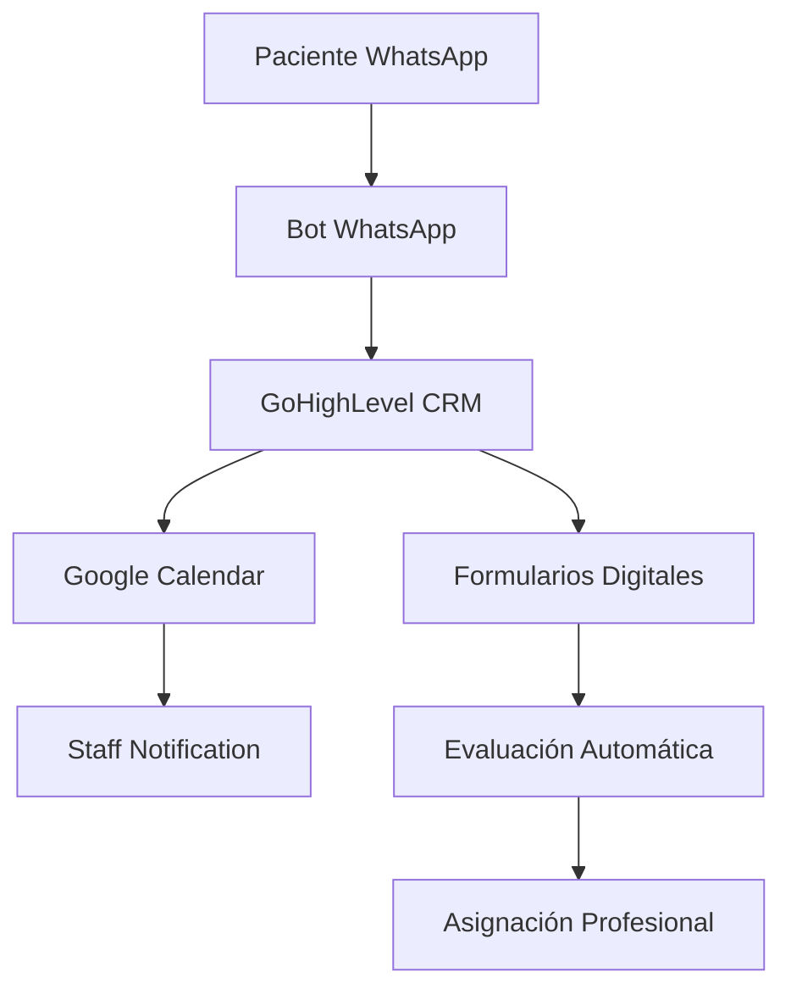

# Sistema Integrado UNEME-CECOSAMA

## Introducción

Este documento presenta la arquitectura técnica y especificaciones de implementación del **Sistema Integrado de Automatización** para las Unidades de Especialidades Médicas - Centro Comunitario de Salud Mental y Adicciones (UNEME-CECOSAMA).

El sistema está diseñado para automatizar y optimizar la gestión de pacientes, desde el primer contacto hasta el alta del tratamiento, utilizando tecnologías modernas de integración y comunicación automatizada.

## Objetivos del Sistema

### 🎯 Objetivos Principales

- **Automatizar la gestión de citas** mediante WhatsApp Business API
- **Digitalizar formularios clínicos** para reducir tiempo de captura
- **Integrar el pipeline de pacientes** en GoHighLevel CRM
- **Sincronizar calendarios** entre plataformas automáticamente
- **Mejorar seguimiento** de pacientes post-sesión
- **Generar reportes automáticos** para compliance y auditorías

### 📊 Métricas de Éxito

| Métrica | Objetivo | Método de Medición |
|---------|----------|-------------------|
| Tiempo de agendamiento | < 2 minutos | Análisis de conversaciones WhatsApp |
| Formularios completados | 95% antes de cita | Dashboard GoHighLevel |
| No-shows reducidos | < 15% | Reportes de asistencia |
| Satisfacción staff | > 8.5/10 | Encuestas trimestrales |
| Compliance reportes | 100% automático | Logs del sistema |

## Stack Tecnológico

### 🏗️ Plataformas Core

=== "GoHighLevel"
    - **Función**: CRM principal y motor de automatización
    - **Responsabilidades**: 
      - Gestión de pipeline de pacientes
      - Almacenamiento de datos clínicos
      - Automatizaciones de seguimiento
      - Generación de reportes

=== "WhatsApp Business API"
    - **Función**: Canal principal de comunicación
    - **Responsabilidades**:
      - Recepción de consultas iniciales
      - Envío de formularios digitales
      - Notificaciones automáticas
      - Agendamiento de citas

=== "Google Calendar"
    - **Función**: Gestión centralizada de citas
    - **Responsabilidades**:
      - Sincronización con GoHighLevel
      - Disponibilidad en tiempo real
      - Notificaciones al staff
      - Integración con dispositivos móviles

### 🔄 Flujo de Integración

## Funcionalidades Principales

### 1. 📱 Gestión de Citas Automatizada

- Agendamiento via WhatsApp con validación de disponibilidad en tiempo real
- Sincronización bidireccional GoHighLevel ↔ Google Calendar
- Notificaciones automáticas (confirmación, recordatorios 24h y 2h antes)
- Reprogramación via WhatsApp con confirmación del staff médico

### 2. 💬 Flujos de Comunicación WhatsApp

- **Bienvenida**: Primer contacto y explicación del proceso de atención
- **Preconsulta Digital**: Envío automático de formularios (PHQ-9, AUDIT, datos básicos)
- **Recordatorios**: Sistema automático de recordatorios de citas
- **Seguimiento**: Evaluaciones post-sesión y seguimiento de alta
- **Emergencias**: Protocolo automático de detección de crisis y derivación urgente

### 3. 🏥 Pipeline de Pacientes en GoHighLevel

| Etapa | Descripción | Criterios de Avance | Automatizaciones |
|-------|-------------|-------------------|------------------|
| **Lead** | Primer contacto via WhatsApp | Respuesta inicial del paciente | Auto-respuesta, asignación de bot |
| **Preconsulta** | Formularios completados | PHQ-9, AUDIT, datos básicos | Envío automático de formularios |
| **Primera Cita** | Agendada y confirmada | Cita confirmada en calendario | Recordatorios automáticos |
| **En Tratamiento** | Sesiones regulares programadas | Asistencia regular a citas | Seguimiento automático |
| **Seguimiento** | Post-alta, evaluaciones | Evaluaciones periódicas | Encuestas de satisfacción |
| **Inactivo** | Pacientes que abandonaron | Sin actividad > 30 días | Intento de reactivación |

### 4. ⚡ Automatizaciones Críticas

- **Auto-respuestas inteligentes** basadas en palabras clave
- **Escalación automática** a staff humano según urgencia
- **Envío de formularios** contextualizados según etapa del paciente
- **Generación de reportes** automáticos para compliance y auditorías
- **Detección de crisis** y protocolo de emergencia automático

## Beneficios Esperados

### 👩‍⚕️ Para el Personal Médico

- Reducción del 70% en tiempo administrativo
- Información clínica pre-organizada antes de cada sesión
- Alertas automáticas de pacientes en riesgo
- Calendarios sincronizados en todos los dispositivos

### 🏥 Para la Institución

- Mejora en indicadores de calidad y tiempo de respuesta
- Reducción de no-shows del 30% al 15%
- Compliance automático con reportes regulatorios
- Escalabilidad para atender más pacientes con mismo personal

### 👤 Para los Pacientes

- Acceso 24/7 para agendar y reprogramar citas
- Recordatorios automáticos que reducen olvidos
- Proceso de admisión más rápido y eficiente
- Seguimiento continuo de su tratamiento

## Próximos Pasos

1. **Revisión de documentación** con equipo médico y administrativo
2. **Validación de flujos** de trabajo propuestos
3. **Configuración de entornos** de desarrollo y pruebas
4. **Capacitación del personal** en nuevos procesos
5. **Implementación gradual** por módulos

---

!!! info "Información Importante"
    Esta documentación está en constante evolución. Para dudas o sugerencias, contactar al equipo de implementación.

!!! warning "Consideraciones de Privacidad"
    Todos los datos de pacientes están protegidos bajo las normativas mexicanas de privacidad de datos médicos. Ver sección de [Compliance](compliance/privacidad-datos.md) para más detalles.