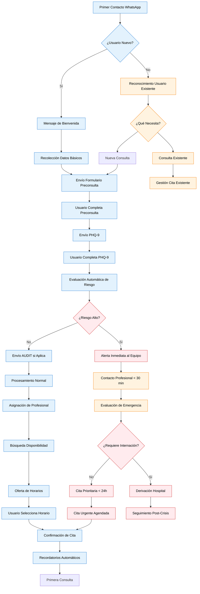

# Proceso de Admisión de Paciente

## Introducción

El proceso de admisión automatizado es el flujo completo desde que un paciente hace su primer contacto vía WhatsApp hasta que tiene su primera cita agendada. Este proceso está completamente automatizado con puntos de escalación humana cuando es necesario.

## Visión General del Proceso

### 🔄 Flujo Completo de Admisión



## Etapas Detalladas del Proceso

### 1. 📱 Primer Contacto (Automatizado)

**Trigger**: Mensaje de usuario no registrado en WhatsApp

**Duración**: 2-3 minutos

**Acciones Automáticas**:

=== "Detección de Usuario Nuevo"
    ```javascript
    function handleFirstContact(incomingMessage) {
        const phoneNumber = incomingMessage.from;
        const existingContact = searchContactInGHL(phoneNumber);
        
        if (!existingContact) {
            return initiateWelcomeFlow(phoneNumber, incomingMessage.text);
        } else {
            return handleReturningUser(existingContact, incomingMessage.text);
        }
    }
    ```

=== "Mensaje de Bienvenida Automático"
    ```
    👋 ¡Hola! Te damos la bienvenida a UNEME-CECOSAMA
    
    Somos el Centro Comunitario de Salud Mental y Adicciones, y estamos aquí para apoyarte.
    
    🌟 *Ofrecemos atención profesional en:*
    • Depresión y ansiedad
    • Problemas de adicciones  
    • Salud mental adolescente
    • Terapia familiar
    • Crisis emocionales
    
    Para comenzar, necesito algunos datos básicos.
    ¿Podrías confirmarme tu nombre completo?
    ```

**Datos Capturados**:
- Número de teléfono (automático)
- Nombre completo
- Edad
- Motivo inicial de consulta

### 2. 📋 Recolección de Información (Semi-Automatizado)

**Duración**: 5-10 minutos

**Proceso**:

=== "Datos Básicos"
    ```
    Pregunta 1: "¿Podrías confirmarme tu nombre completo?"
    └── Validación: Mínimo 2 palabras
    
    Pregunta 2: "Gracias {nombre}. ¿Cuál es tu edad?"
    └── Validación: 12-99 años
    ├── Si < 18: Activar flujo para menores
    └── Si ≥ 18: Continuar flujo normal
    
    Pregunta 3: "¿Cuál es el motivo principal de tu consulta?"
    └── Análisis de palabras clave para detección temprana de crisis
    ```

=== "Creación de Contacto en GoHighLevel"
    ```javascript
    async function createContactInGHL(userData) {
        const contactData = {
            firstName: userData.nombres,
            lastName: userData.apellidos,
            phone: userData.telefono,
            customFields: {
                edad_paciente: userData.edad,
                motivo_consulta: userData.motivoConsulta,
                fuente_referencia: 'WhatsApp',
                fecha_primer_contacto: new Date().toISOString(),
                estado_proceso: 'datos_basicos_capturados'
            },
            tags: determineInitialTags(userData)
        };
        
        const response = await ghlAPI.createContact(contactData);
        return response.contact.id;
    }
    ```

### 3. 📝 Envío de Formularios (Automatizado)

**Duración**: 15-30 minutos (tiempo del usuario)

**Secuencia**:

=== "Formulario de Preconsulta"
    ```
    📋 Para una evaluación más completa, te enviaré dos cuestionarios breves:
    
    • *Formulario de Preconsulta*: Información general (5 minutos)
    • *PHQ-9*: Evaluación de estado de ánimo (3 minutos)
    
    ¿Estás listo/a para comenzar?
    Responde *SÍ* para continuar.
    ```

=== "Link Personalizado"
    ```javascript
    function generateFormLink(contactId, formType) {
        const baseURL = 'https://forms.uneme-system.com';
        const token = generateSecureToken(contactId, formType);
        return `${baseURL}/${formType}/${contactId}?token=${token}`;
    }
    ```

=== "Seguimiento Automático"
    ```
    Horario: +15 minutos si no completa
    Mensaje: "¿Hay algún problema técnico con el formulario?"
    
    Horario: +1 hora si no completa  
    Mensaje: "Te envío nuevamente el enlace del formulario"
    
    Horario: +24 horas si no completa
    Acción: Escalación a recepcionista para contacto humano
    ```

### 4. ⚡ Evaluación Automática de Riesgo

**Duración**: Inmediata (< 30 segundos)

**Criterios de Evaluación**:

=== "Riesgo Crítico (Intervención Inmediata)"
    - PHQ-9 pregunta 9 > 1 (ideación suicida)
    - PHQ-9 total ≥ 20 (depresión severa)
    - Palabras clave de crisis en motivo de consulta
    - Menor de edad con riesgo alto
    
    **Acción**: Alerta inmediata + protocolo de crisis

=== "Riesgo Alto (Atención Prioritaria)"
    - PHQ-9 total 15-19 (depresión moderada-severa)
    - AUDIT ≥ 16 (dependencia al alcohol)
    - Combinación de factores de riesgo
    
    **Acción**: Cita prioritaria < 48 horas

=== "Riesgo Moderado (Atención Regular)"
    - PHQ-9 total 10-14 (depresión moderada)
    - AUDIT 8-15 (consumo de riesgo)
    - Factores de riesgo menores
    
    **Acción**: Cita regular < 7 días

=== "Riesgo Bajo (Atención Programada)"
    - PHQ-9 total < 10
    - AUDIT < 8
    - Sin factores de riesgo significativos
    
    **Acción**: Cita regular < 14 días

### 5. 👩‍⚕️ Asignación de Profesional (Automatizado)

**Criterios de Asignación**:

=== "Por Especialidad"
    ```javascript
    function assignProfessional(patientData, riskAssessment) {
        const criteria = {
            age: patientData.edad,
            riskLevel: riskAssessment.level,
            primaryConcern: analyzePrimaryConcern(patientData.motivoConsulta),
            availableProfessionals: getProfessionalsOnShift()
        };
        
        // Reglas de asignación
        if (criteria.age < 18) {
            return findProfessional('psicologo_adolescentes', criteria.riskLevel);
        }
        
        if (criteria.riskLevel === 'critico') {
            return findProfessional('psiquiatra', 'disponible_ahora');
        }
        
        if (criteria.primaryConcern.includes('adiccion')) {
            return findProfessional('especialista_adicciones', criteria.riskLevel);
        }
        
        return findProfessional('psicologo_general', criteria.riskLevel);
    }
    ```

=== "Por Disponibilidad"
    ```javascript
    function findProfessional(specialty, urgency) {
        const professionals = professionalDatabase[specialty];
        
        const available = professionals.filter(prof => {
            return prof.isActive && 
                   prof.currentCaseload < prof.maxCaseload &&
                   prof.availability.includes(urgency);
        });
        
        // Algoritmo de distribución de carga
        return available.sort((a, b) => a.currentCaseload - b.currentCaseload)[0];
    }
    ```

### 6. 📅 Agendamiento de Cita (Automatizado)

**Proceso de Agenda**:

=== "Búsqueda de Disponibilidad"
    ```javascript
    async function findAvailableSlots(professionalId, urgencyLevel) {
        const timeframes = {
            'critico': { hours: 2, priority: 1 },
            'alto': { hours: 24, priority: 2 },
            'moderado': { days: 3, priority: 3 },
            'bajo': { days: 14, priority: 4 }
        };
        
        const timeframe = timeframes[urgencyLevel];
        const calendar = await getGoogleCalendar(professionalId);
        
        return calendar.findFreeSlots({
            startDate: new Date(),
            endDate: addTime(new Date(), timeframe),
            duration: 50, // minutos
            bufferTime: 10 // minutos entre citas
        });
    }
    ```

=== "Presentación de Opciones"
    ```
    📅 *Horarios disponibles para tu consulta:*
    
    1️⃣ **Mañana Jueves 15 Nov**
       🕙 10:00 AM con Dr. García (Psicólogo)
    
    2️⃣ **Mañana Jueves 15 Nov**  
       🕑 2:00 PM con Dra. López (Psicóloga)
    
    3️⃣ **Viernes 16 Nov**
       🕘 9:00 AM con Dr. García (Psicólogo)
    
    Responde con el número de tu opción preferida.
    O escribe "OTROS" para ver más horarios.
    ```

### 7. ✅ Confirmación y Preparación (Automatizado)

**Después de selección de horario**:

=== "Confirmación de Cita"
    ```
    🎉 *¡Cita confirmada!*
    
    📅 **Detalles de tu cita:**
    • Fecha: Jueves 15 de Noviembre 2024
    • Hora: 10:00 AM - 10:50 AM
    • Profesional: Dr. Juan García (Psicólogo Clínico)
    • Modalidad: Presencial
    • Ubicación: UNEME-CECOSAMA
      Calle Principal #123, Col. Centro
    
    📍 **Cómo llegar:** [Link Google Maps]
    
    📋 **Documentos a traer:**
    • Identificación oficial
    • Comprobante de domicilio (si es primera vez)
    
    📲 **Recordatorios automáticos:**
    • 24 horas antes
    • 2 horas antes
    
    ¿Confirmas que toda la información es correcta?
    ```

=== "Preparación del Expediente"
    ```javascript
    async function preparePatientFile(contactId, appointmentData) {
        const patientData = await getContactData(contactId);
        const formResponses = await getFormResponses(contactId);
        
        const expediente = {
            datosPersonales: patientData,
            formularios: {
                preconsulta: formResponses.preconsulta,
                phq9: formResponses.phq9,
                audit: formResponses.audit
            },
            evaluacionRiesgo: formResponses.riskAssessment,
            citaInicial: appointmentData,
            profesionalAsignado: appointmentData.professional,
            preparadoPor: 'Sistema Automatizado',
            fechaPreparacion: new Date().toISOString()
        };
        
        // Notificar al profesional
        await notifyProfessional(expediente);
        
        return expediente;
    }
    ```

## Métricas y KPIs del Proceso

### 📊 Indicadores de Rendimiento

| KPI | Objetivo | Método de Cálculo |
|-----|----------|-------------------|
| **Tiempo Total de Admisión** | < 2 horas | Timestamp primer contacto → cita confirmada |
| **Tasa de Completación** | > 85% | Contactos con cita confirmada / Total contactos |
| **Abandono por Etapa** | < 10% por etapa | Abandonos en etapa / Ingresos a etapa |
| **Precisión de Asignación** | > 90% | Asignaciones apropiadas / Total asignaciones |
| **Satisfacción de Admisión** | > 8.5/10 | Encuesta post-primera cita |

### 📈 Dashboard de Admisiones

```javascript
const admissionMetrics = {
    today: {
        nuevosContactos: 23,
        formularios_completados: 19,
        citas_agendadas: 17,
        alertas_crisis: 2,
        tiempo_promedio: '1h 45min'
    },
    thisWeek: {
        conversion_rate: '89.2%',
        abandonment_by_stage: {
            datos_basicos: '5.2%',
            formularios: '8.7%',
            agendamiento: '3.1%'
        },
        risk_distribution: {
            bajo: '67%',
            moderado: '23%', 
            alto: '8%',
            critico: '2%'
        }
    }
};
```

## Puntos de Escalación Humana

### 👤 Cuándo Escalar a Personal Humano

=== "Escalación Inmediata (< 5 minutos)"
    - Detección de crisis suicida
    - Reportes de violencia/abuso
    - Menores en situación de riesgo
    - Fallos técnicos críticos

=== "Escalación Prioritaria (< 30 minutos)"
    - Casos complejos que bot no puede resolver
    - Solicitudes específicas fuera del flujo
    - Problemas con agendamiento
    - Usuarios confundidos o frustrados

=== "Escalación Regular (< 2 horas)"
    - Formularios incompletos después de 24h
    - Solicitudes de información específica
    - Reprogramaciones complejas
    - Feedback negativo sobre el proceso

### 🔄 Protocolo de Transición

```
👤 *Te conectaré con un especialista*

{nombre}, voy a transferirte con un miembro de nuestro equipo que podrá ayudarte mejor con tu consulta.

⏰ Un profesional se comunicará contigo en los próximos {tiempo_estimado}.

Mientras tanto, si tienes una emergencia:
🚨 Línea de Crisis: 800-911-2000

Gracias por tu paciencia 😊
```

## Optimización Continua

### 🔍 Análisis de Abandono

```javascript
function analyzeDropoffPoints() {
    const stages = [
        'primer_contacto',
        'datos_basicos', 
        'formulario_preconsulta',
        'formulario_phq9',
        'seleccion_horario',
        'confirmacion_cita'
    ];
    
    const dropoffAnalysis = stages.map(stage => {
        const entered = getStageEntries(stage);
        const completed = getStageCompletions(stage);
        const abandoned = entered - completed;
        
        return {
            stage: stage,
            abandonment_rate: (abandoned / entered * 100).toFixed(1),
            common_exit_points: getCommonExitReasons(stage),
            optimization_opportunities: identifyOptimizations(stage)
        };
    });
    
    return dropoffAnalysis;
}
```

### 📊 A/B Testing

**Elementos a Testear**:
- Mensajes de bienvenida
- Secuencia de preguntas
- Timing de seguimientos
- Opciones de horarios presentadas
- Mensajes de confirmación

---

## Checklist de Implementación

### ✅ Configuración Técnica
- [ ] Integración WhatsApp Business API
- [ ] Webhooks GoHighLevel configurados
- [ ] Formularios digitales implementados
- [ ] Sistema de evaluación de riesgo
- [ ] Integración Google Calendar

### ✅ Protocolos Médicos
- [ ] Definir criterios de riesgo
- [ ] Entrenar al equipo en escalaciones
- [ ] Protocolos de crisis implementados
- [ ] Flujos de asignación por especialidad
- [ ] Procedimientos de seguimiento

### ✅ Monitoreo y Optimización
- [ ] Dashboard de métricas en tiempo real
- [ ] Alertas automáticas por fallos
- [ ] Reportes de abandono por etapa
- [ ] Sistema de feedback de usuarios
- [ ] Análisis de satisfacción

!!! warning "Validaciones Pendientes"
    **[PENDIENTE - VALIDAR CON CLIENTE]**: 
    - Horarios exactos de operación
    - Criterios específicos de asignación por profesional
    - Protocolos internos de escalación
    - Tiempos de respuesta esperados por tipo de urgencia

!!! tip "Mejora Continua"
    Revisar semanalmente las métricas de abandono y optimizar los puntos con mayor pérdida de usuarios. El objetivo es un proceso fluido que genere confianza y reduzca la fricción para los pacientes.