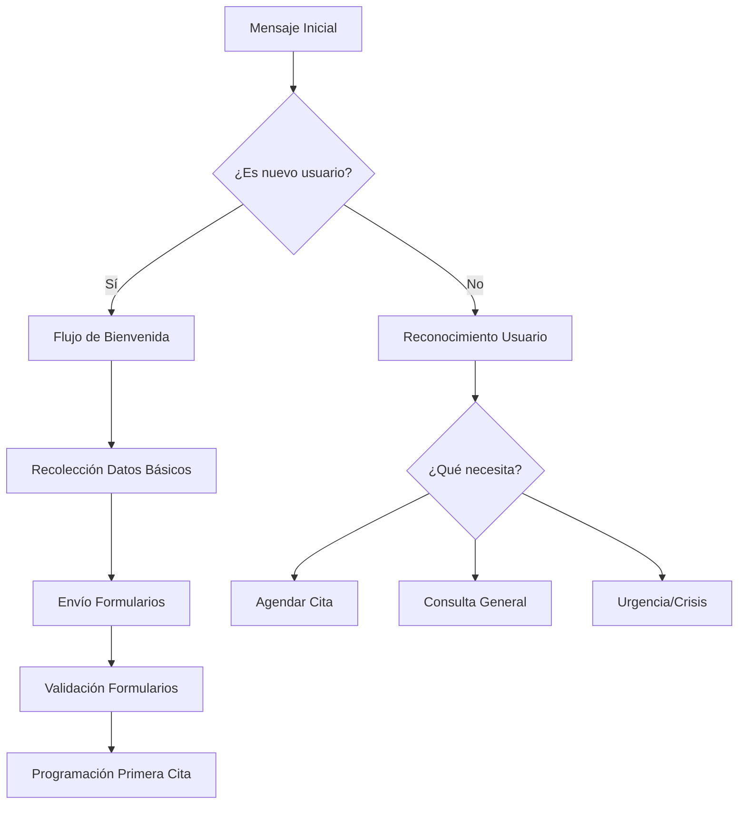

# Flujos de Conversación WhatsApp

## Introducción

Los flujos conversacionales de WhatsApp constituyen el primer punto de contacto con los pacientes y son críticos para el éxito del sistema. Esta sección detalla todos los scripts, respuestas automáticas y lógica de conversación implementados.

## Arquitectura de Conversación

### 🗣️ Estructura del Bot



## Flujos Principales

### 🚀 Flujo 1: Bienvenida y Primer Contacto

**Trigger**: Primer mensaje de usuario no registrado

=== "Mensaje de Bienvenida"
    ```
    👋 ¡Hola! Te damos la bienvenida a UNEME-CECOSAMA
    
    Somos el Centro Comunitario de Salud Mental y Adicciones, y estamos aquí para apoyarte.
    
    🌟 *Ofrecemos atención profesional en:*
    • Depresión y ansiedad
    • Problemas de adicciones  
    • Salud mental adolescente
    • Terapia familiar
    • Crisis emocionales
    
    Para comenzar, necesito algunos datos básicos.
    
    ¿Podrías confirmarme tu nombre completo?
    ```

=== "Recolección de Datos"
    **Después de recibir el nombre:**
    ```
    Gracias {nombre} 😊
    
    Para brindarte la mejor atención, necesito:
    
    1️⃣ Tu edad
    2️⃣ ¿Cuál es el motivo principal de tu consulta?
    
    Puedes escribir libremente, toda la información es confidencial y está protegida por el secreto profesional.
    ```

=== "Confirmación y Siguiente Paso"
    **Después de datos básicos:**
    ```
    Perfecto {nombre}, gracias por confiar en nosotros.
    
    📋 Para una evaluación más completa, te enviaré dos cuestionarios breves que nos ayudarán a entender mejor tu situación:
    
    • *PHQ-9*: Evaluación de estado de ánimo (2 minutos)
    • *Cuestionario básico*: Información general (3 minutos)
    
    ¿Estás listo/a para comenzar con los cuestionarios?
    
    Responde *SÍ* para continuar o *AYUDA* si tienes preguntas.
    ```

### 📋 Flujo 2: Envío de Formularios

**Trigger**: Usuario confirma disposición para formularios

=== "Envío PHQ-9"
    ```
    📝 *Cuestionario PHQ-9 - Evaluación de Estado de Ánimo*
    
    Este cuestionario nos ayuda a entender cómo te has sentido en las últimas 2 semanas.
    
    🔗 **Link del formulario**: https://forms.uneme.gob.mx/phq9/{user_id}
    
    ⏰ *Tiempo estimado*: 2-3 minutos
    🔒 *Confidencial*: Toda información está protegida
    
    Una vez que completes este formulario, te enviaré el siguiente.
    
    Si tienes problemas técnicos, escribe *AYUDA*
    ```

=== "Seguimiento PHQ-9"
    **15 minutos después si no se completa:**
    ```
    Hola {nombre} 👋
    
    Veo que aún no has completado el cuestionario PHQ-9.
    
    ¿Hay algún problema técnico o tienes alguna pregunta?
    
    💡 *Recuerda*:
    • El formulario toma solo 2-3 minutos
    • Es completamente confidencial
    • Nos ayuda a brindarte mejor atención
    
    🔗 Link: https://forms.uneme.gob.mx/phq9/{user_id}
    
    O escribe *AYUDA* si necesitas asistencia.
    ```

=== "PHQ-9 Completado"
    **Trigger**: Formulario PHQ-9 enviado**
    ```
    ✅ *¡Excelente!* Has completado el primer cuestionario.
    
    📊 Hemos recibido tu evaluación y será revisada por nuestro equipo médico.
    
    📋 *Ahora el segundo cuestionario*:
    Información general sobre tu salud
    
    🔗 **Link**: https://forms.uneme.gob.mx/preconsulta/{user_id}
    
    Este último cuestionario nos ayudará a preparar tu primera consulta de la mejor manera.
    ```

### 🚨 Flujo 3: Detección de Crisis

**Trigger**: Palabras clave de riesgo o PHQ-9 con puntuación alta

=== "Palabras Clave de Crisis"
    ```
    # Sistema detecta: "suicidio", "matarme", "no quiero vivir", "terminar con todo", etc.
    ```

=== "Respuesta Inmediata Crisis"
    ```
    🚨 *ATENCIÓN PRIORITARIA* 🚨
    
    {nombre}, entiendo que estás pasando por un momento muy difícil y es importante que recibas atención inmediata.
    
    🔴 *LÍNEAS DE CRISIS 24/7*:
    • Línea de la Vida: 800-911-2000
    • Cruz Roja: 911
    • Locatel: 56-58-11-11
    
    👩‍⚕️ *Te conectaré ahora mismo con nuestro coordinador médico*
    
    Un profesional te contactará en los próximos 15 minutos.
    
    💜 No estás solo/a. Estamos aquí para apoyarte.
    
    ¿Puedes confirmarme que estás seguro/a en este momento?
    ```

=== "Seguimiento Crisis"
    **Para equipo médico:**
    ```
    🚨 ALERTA DE CRISIS 🚨
    
    Paciente: {nombre}
    Teléfono: {phone}
    Mensaje trigger: "{mensaje_original}"
    Hora: {timestamp}
    
    ACCIÓN REQUERIDA: Contacto inmediato
    Estado: PENDIENTE CONTACTO
    ```

### 📅 Flujo 4: Agendamiento de Citas

**Trigger**: Formularios completados o solicitud directa de cita

=== "Invitación a Agendar"
    ```
    🎉 *¡Formularios completados!* 
    
    Gracias {nombre} por proporcionar toda la información.
    
    📅 *Es momento de agendar tu primera consulta*
    
    Nuestros horarios disponibles son:
    • Lunes a Viernes: 8:00 AM - 4:00 PM
    • Sábados: 8:00 AM - 12:00 PM
    
    ¿Qué día y horario te acomoda mejor?
    
    💡 Puedes escribir por ejemplo:
    • "Lunes en la mañana"
    • "Miércoles 10 AM"
    • "Cualquier día esta semana"
    ```

=== "Confirmación de Disponibilidad"
    **Después de solicitud específica:**
    ```
    📋 Verificando disponibilidad para {día} {hora}...
    
    ✅ *¡Perfecto!* Tenemos disponibilidad
    
    📅 *Tu cita queda confirmada*:
    • Fecha: {fecha_completa}
    • Hora: {hora}
    • Duración: 50 minutos
    • Profesional: {nombre_profesional}
    • Ubicación: UNEME-CECOSAMA {direccion}
    
    📲 *Recordatorios automáticos*:
    • 24 horas antes
    • 2 horas antes
    
    ¿Confirmas que la información es correcta?
    ```

=== "Sin Disponibilidad"
    ```
    😔 Lo siento, no tenemos disponibilidad para {día} {hora}
    
    📅 *Horarios alternativos cercanos*:
    1️⃣ {opcion_1}
    2️⃣ {opcion_2}
    3️⃣ {opcion_3}
    
    Responde con el número de tu opción preferida o escribe otro horario que te acomode.
    
    También puedes escribir *CUALQUIERA* para que te asigne la próxima cita disponible.
    ```

### 🔄 Flujo 5: Recordatorios de Cita

=== "Recordatorio 24 Horas"
    **Trigger**: 24 horas antes de la cita
    ```
    ⏰ *Recordatorio de Cita* - UNEME-CECOSAMA
    
    Hola {nombre} 👋
    
    Te recordamos tu cita programada para mañana:
    
    📅 *Detalles*:
    • Fecha: {fecha}
    • Hora: {hora}
    • Profesional: {profesional}
    • Ubicación: {direccion}
    
    📍 *¿Cómo llegar?*
    {link_google_maps}
    
    📋 *Documentos a traer*:
    • Identificación oficial
    • Comprobante de domicilio (si es primera vez)
    
    Si necesitas reprogramar, responde *REPROGRAMAR*
    Para confirmar asistencia, responde *CONFIRMO*
    ```

=== "Recordatorio 2 Horas"
    **Trigger**: 2 horas antes de la cita
    ```
    🕐 *¡Tu cita es en 2 horas!*
    
    {nombre}, te esperamos hoy a las {hora} en UNEME-CECOSAMA
    
    📍 Ubicación: {direccion}
    🅿️ Estacionamiento disponible
    ☕ Te recomendamos llegar 10 minutos antes
    
    Si tienes algún contratiempo, comunícate de inmediato al {telefono_emergencia}
    
    ¡Te esperamos! 😊
    ```

### 📞 Flujo 6: Reprogramación de Citas

**Trigger**: Usuario solicita reprogramar

=== "Solicitud de Reprogramación"
    ```
    📅 *Reprogramación de Cita*
    
    Entiendo que necesitas cambiar tu cita del {fecha_original} a las {hora_original}.
    
    ¿Cuál es el motivo del cambio?
    1️⃣ Enfermedad
    2️⃣ Compromiso laboral
    3️⃣ Emergencia familiar
    4️⃣ Otro motivo
    
    Una vez que me indiques el motivo, te mostraré nuevas opciones disponibles.
    ```

=== "Nuevas Opciones"
    ```
    📋 *Nuevas fechas disponibles*:
    
    1️⃣ {opcion_1}
    2️⃣ {opcion_2}  
    3️⃣ {opcion_3}
    
    Responde con el número de tu nueva preferencia.
    
    ⚠️ *Política de reprogramación*:
    • Máximo 2 reprogramaciones por paciente
    • Con mínimo 4 horas de anticipación
    • Sin costo adicional
    ```

## Respuestas Automáticas por Contexto

### 🤖 Reconocimiento de Intenciones

=== "Horarios de Atención"
    **Trigger**: "horarios", "qué hora", "cuando atienden"
    ```
    🕐 *Horarios de Atención UNEME-CECOSAMA*
    
    📅 Lunes a Viernes: 8:00 AM - 4:00 PM
    📅 Sábados: 8:00 AM - 12:00 PM
    📅 Domingos: Cerrado
    
    🚨 *Urgencias 24/7*: 
    Línea de Crisis: 800-911-2000
    
    Para agendar cita, escribe *CITA*
    Para información general, escribe *INFO*
    ```

=== "Ubicación"
    **Trigger**: "donde están", "dirección", "ubicación"
    ```
    📍 *Ubicación UNEME-CECOSAMA*
    
    🏥 {direccion_completa}
    
    🗺️ Google Maps: {link_maps}
    
    🚗 *Cómo llegar*:
    • En auto: Estacionamiento disponible
    • Transporte público: {instrucciones_transporte}
    
    📞 Teléfono: {telefono}
    
    ¿Necesitas que te ayude a agendar una cita?
    ```

=== "Costos"
    **Trigger**: "costo", "precio", "cuanto cuesta"
    ```
    💰 *Información de Costos*
    
    ✅ *CONSULTAS GRATUITAS*
    
    Todos nuestros servicios son completamente gratuitos:
    • Primera consulta
    • Terapias individuales
    • Terapias familiares
    • Terapias grupales
    • Seguimiento post-tratamiento
    
    🏛️ Somos una institución pública del Sector Salud
    
    ¿Te gustaría agendar tu consulta gratuita?
    ```

### 🔤 Palabras Clave y Escalación

=== "Crisis y Emergencia"
    **Palabras clave**: suicidio, matarme, acabar, terminar con todo, no aguanto, me quiero morir
    **Acción**: Activar protocolo de crisis + notificación inmediata a coordinador

=== "Violencia"
    **Palabras clave**: golpes, abuso, violación, maltrato, me pegan
    **Acción**: Protocolo de violencia + contacto con trabajador social

=== "Drogas/Alcohol"
    **Palabras clave**: drogas, alcohol, coca, piedra, cristal, no puedo parar
    **Acción**: Envío automático de AUDIT + prioridad alta

=== "Menores"
    **Palabras clave**: mi hijo, adolescente, menor, escuela
    **Acción**: Activar flujo específico para menores + solicitar datos del responsable

## Mensajes Fuera de Horario

### 🌙 Respuesta Nocturna (6 PM - 8 AM)

```
🌙 *Mensaje Recibido - Fuera de Horario*

Hola {nombre}, hemos recibido tu mensaje.

🕐 Nuestro horario de atención es:
• Lunes a Viernes: 8:00 AM - 4:00 PM  
• Sábados: 8:00 AM - 12:00 PM

📨 Tu mensaje será atendido mañana por la mañana

🚨 *Si tienes una EMERGENCIA*:
• Línea de la Vida: 800-911-2000
• Cruz Roja: 911
• Urgencias médicas: 911

💜 Recuerda que no estás solo/a
```

### 📅 Respuesta de Fin de Semana

```
📅 *Mensaje de Fin de Semana*

Hola {nombre} 👋

Hemos recibido tu mensaje. 

🗓️ Estaremos de vuelta el lunes a las 8:00 AM para atenderte.

🚨 *Para emergencias*:
• Línea Nacional de Prevención del Suicidio: 800-911-2000
• Servicios de emergencia: 911

Tu bienestar es importante para nosotros.
Te contactaremos el lunes por la mañana.

¡Que tengas un buen fin de semana! 😊
```

## Escalación a Humano

### 👤 Criterios de Escalación Automática

1. **Inmediata (< 5 minutos)**:
   - Palabras clave de crisis suicida
   - Reportes de violencia
   - Menores en riesgo

2. **Prioritaria (< 30 minutos)**:
   - PHQ-9 score ≥ 15
   - AUDIT score ≥ 16
   - Solicitudes complejas que bot no puede resolver

3. **Normal (< 2 horas)**:
   - Reprogramaciones complejas
   - Quejas o inconformidades
   - Solicitudes de información específica

### 🔄 Mensaje de Transición

```
👤 *Conectando con Especialista*

{nombre}, voy a conectarte con un miembro de nuestro equipo médico que podrá ayudarte mejor.

⏰ Tiempo estimado de espera: {tiempo_estimado}

Un profesional se comunicará contigo pronto.

Mientras tanto, si tienes una emergencia inmediata, marca:
🚨 Línea de Crisis: 800-911-2000
```

---

## Configuración Técnica

### 🔧 Parámetros del Bot

| Parámetro | Valor | Descripción |
|-----------|-------|-------------|
| `response_delay` | 2-5 segundos | Simular escritura humana |
| `max_message_length` | 1000 caracteres | Límite por mensaje |
| `session_timeout` | 30 minutos | Tiempo de sesión activa |
| `escalation_timeout` | 15 minutos | Tiempo antes de escalar |
| `crisis_keywords` | Lista actualizable | Palabras que activan crisis |

### 📊 Métricas de Conversación

- **Tasa de respuesta automática**: > 95%
- **Tiempo promedio de respuesta**: < 30 segundos
- **Completión de formularios**: > 80%
- **Escalación correcta**: > 90%
- **Satisfacción de usuarios**: > 8.5/10

!!! warning "Validaciones Pendientes"
    **[PENDIENTE - VALIDAR CON CLIENTE]**: 
    - Horarios exactos de atención
    - Teléfonos de emergencia específicos
    - Direcciones y referencias locales
    - Protocolos internos de escalación

!!! tip "Optimización Continua"
    Los flujos de conversación deben revisarse mensualmente basado en:
    - Análisis de conversaciones reales
    - Feedback del equipo médico
    - Métricas de efectividad
    - Nuevas necesidades identificadas